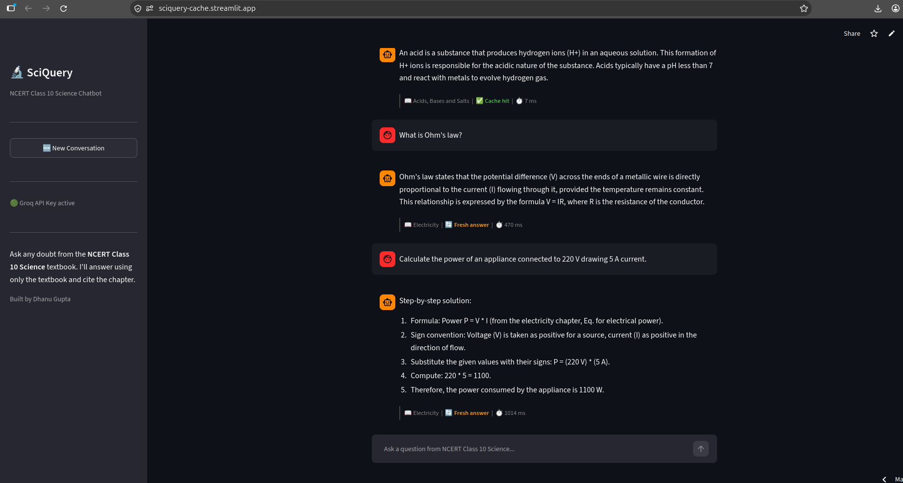
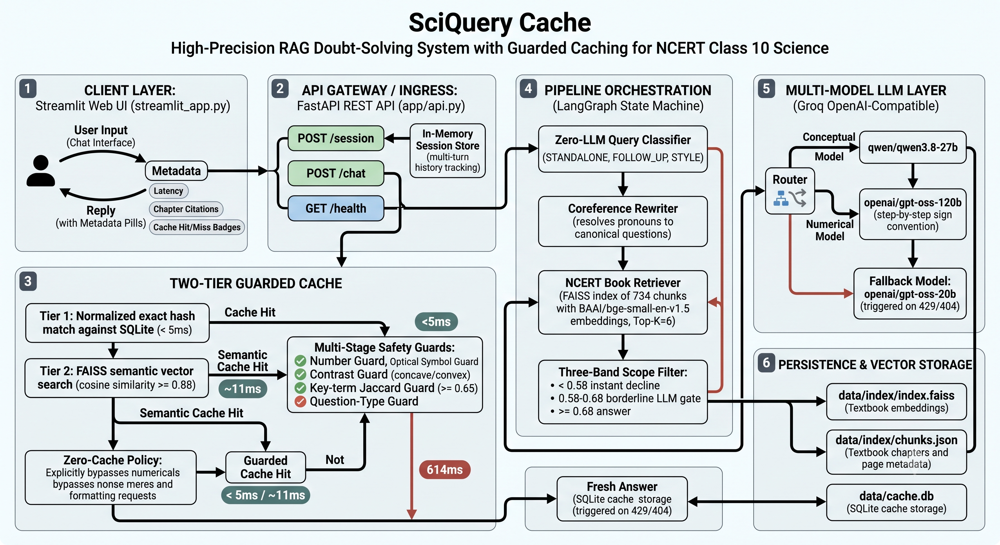
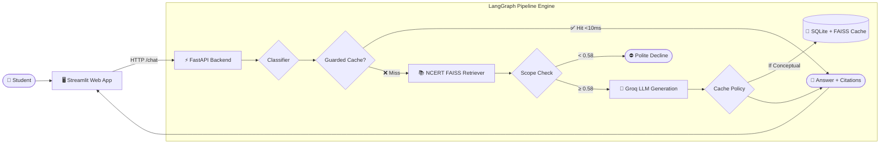

# 🔬 SciQuery — NCERT Class 10 Science Doubt Solver

> A doubt-solving AI assistant for the **NCERT Class 10 Science** textbook, powered by a safety-guarded semantic cache that delivers verified answers with **sub-10ms latency**.

[](https://sciquery-cache.streamlit.app/)
[](https://github.com/Dhanugupta0/sciquery-cache)
[](https://opensource.org/licenses/MIT)

👉 **Live App**: [https://sciquery-cache.streamlit.app/](https://sciquery-cache.streamlit.app/)  
💻 **Repository**: [https://github.com/Dhanugupta0/sciquery-cache.git](https://github.com/Dhanugupta0/sciquery-cache.git)  
👤 **Author**: Dhanu Gupta

---

## 📸 App Interface

Click below to try the live app:

[](https://sciquery-cache.streamlit.app/)

---

## 🏛️ System Architecture (HLD)





---

## ⚡ Key Features

- **Strict Textbook Grounding**: Answers only from NCERT Class 10 Science with chapter and page citations.
- **2-Tier Intelligent Cache**:
  - **Tier 1 (Exact Hash)**: Instant SQLite lookup (**~5 ms**).
  - **Tier 2 (Semantic Vector)**: FAISS cosine similarity $\ge 0.88$ (**~11 ms**).
- **5 Multi-Stage Safety Guards**:
  - **Number Guard**: Prevents numeric mismatches (e.g. 220V vs 110V).
  - **Symbol Guard**: Matches optical points (`C`, `F`, `P`) and circuit symbols.
  - **Contrast Guard**: Rejects opposite concepts (`concave` vs `convex`, `acid` vs `base`).
  - **Key-Term Guard**: Requires $\ge 0.65$ Jaccard keyword overlap.
  - **Question-Type Guard**: Prevents collision between definitions and numericals.
- **Zero-Cache for Numericals**: Calculations are routed to a specialized numerical model (`openai/gpt-oss-120b`) and **never cached** to ensure fresh, step-by-step arithmetic.
- **Conversational Context**: Resolves follow-up pronouns automatically (*"What is its unit?"* ➡️ *"What is the unit of current?"*).
- **Fast Boundary Rejection**: Declines off-topic questions in **< 60 ms** without burning LLM tokens.

---

## ⏱️ Measured Latency Benchmarks

| Request Path | Store Latency | End-to-End API Latency |
| :--- | :--- | :--- |
| **Exact Cache Hit** | 0.08 ms | **~5 ms** (4.59 ms median) |
| **Semantic Cache Hit** (FAISS + 5 Guards) | 5.79 ms | **~11 ms** (10.73 ms median) |
| **Fresh LLM Generation** | N/A | **~0.6 to 1.8 s** (614 ms median) |
| **Out-of-Scope Decline** | N/A | **< 60 ms** (Zero LLM calls) |

---

## 🚀 Quick Start

### 1. Clone & Install
```bash
git clone https://github.com/Dhanugupta0/sciquery-cache.git
cd sciquery-cache
pip install -r requirements.txt
```

### 2. Configure Environment
Create a `.env` file in the project root:
```env
LLM_BASE_URL=https://api.groq.com/openai/v1
LLM_API_KEY=your_groq_api_key_here
LLM_MODEL=qwen/qwen3.8-27b
LLM_NUMERIC_MODEL=openai/gpt-oss-120b
LLM_FALLBACK_MODEL=openai/gpt-oss-20b
```
*(Tip: You can also enter your Groq API key directly in the Streamlit sidebar at runtime).*

### 3. Run Locally
```bash
streamlit run streamlit_app.py
```

### 4. Run Tests
```bash
pytest tests/ -v
```
*(All 84 unit and pipeline tests pass).*

---

## 📡 API Endpoints

FastAPI runs on port `8321` (or your configured `PORT`):

- **`GET /health`** — Liveness check: `{"status": "ok"}`
- **`POST /session`** — Create chat session: `{"session_id": "uuid"}`
- **`POST /chat`** — Query the pipeline:
  ```json
  // Request
  {
    "session_id": "your-session-id",
    "message": "What is Ohm's law?"
  }

  // Response
  {
    "reply": "Ohm's law states that the potential difference across a conductor is proportional to the current...",
    "citations": ["Electricity"],
    "cache_hit": true,
    "latency_ms": 5.2
  }
  ```

---

## 📂 Project Structure

```
sciquery-cache/
├── streamlit_app.py          # Streamlit UI frontend
├── app/
│   ├── api.py                # FastAPI routes (/session, /chat, /health)
│   ├── config.py             # Config & dynamic API key resolution
│   ├── graph.py              # LangGraph pipeline state machine
│   ├── llm.py                # Model client & prompt definitions
│   ├── retriever.py          # NCERT FAISS retriever (734 chunks)
│   ├── sessions.py           # In-memory multi-turn session store
│   └── cache/
│       ├── guards.py         # 5 safety guards
│       ├── policy.py         # Zero-cache & style policies
│       ├── normalize.py      # Keyword & symbol extraction
│       └── store.py          # SQLite + FAISS cache store
├── data/
│   ├── index/                # Pre-built FAISS vector index & metadata
│   └── cache.db              # SQLite cache database
├── img/
│   ├── image.png             # UI screenshot
│   └── hld_architecture.png  # High-Level Design diagram
└── tests/                    # 84 test cases
```
