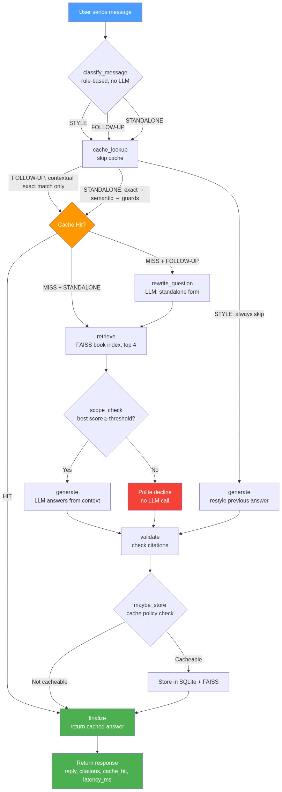

# SciQuery: Architecture & Smart Caching Explainer

**SciQuery** is a RAG doubt-solving assistant for NCERT Class 10 Science that pairs semantic retrieval with a high-precision, safety-guarded semantic cache.

### 1. How the Chatbot Works
1. **Classification**: User queries are categorized into `STANDALONE` (new doubt), `FOLLOW_UP` (context-dependent query), or `STYLE` (formatting/simplification request) without calling an LLM.
2. **Follow-Up Rewrite**: Ambiguous follow-ups are contextualized into self-contained questions by an LLM prompt. Self-contained queries are preserved unchanged.
3. **Retrieval**: Relevant passages are retrieved from a FAISS index of 734 NCERT book chunks using `bge-small-en-v1.5` embeddings.
4. **Out-of-Scope Detection**: Calibrated borderline band: retrieval score < 0.58 declines without LLM calls; 0.58–0.68 lets the LLM decide; ≥ 0.68 answers.
5. **Generation**: The LLM answers strictly using retrieved context and provides chapter-level citations.

### 2. How the Cache Works
The cache sits before retrieval and LLM stages to deliver safe answers at ultra-low latency:
- **Latency Profile**: Exact hit ~5 ms end to end (0.08 ms store), semantic hit ~11 ms (5.8 ms store), fresh answer about 0.4 to 2 s normally and up to ~10 s when rate-limited.
- **Exact Hash Match**: Normalized queries perform an instant SQLite lookup.
- **Semantic Candidate Retrieval**: Queries without numbers search a FAISS vector index (cosine similarity ≥ 0.88).
- **Five Multi-Stage Safety Guards**:
  - *Number Guard*: Ensures numeric values and units match identically.
  - *Symbol Guard*: Enforces exact matching of single letters (e.g., optical points `C`, `F`, `P`) and alphanumeric symbols (`2f`, `2f1`).
  - *Contrast Guard*: Detects mutually exclusive pairs (e.g., `concave`/`convex`, `acid`/`base`, plurals) to reject opposite concepts.
  - *Key-Term Guard*: Verifies keyword overlap (Jaccard similarity ≥ 0.65) after stopword and synonym filtering.
  - *Question-Type Guard*: Ensures intent compatibility (`define`, `law`, `numerical`, `difference`).

### 3. What We Cache
- Verified standalone NCERT textbook questions with valid chapter citations.
- Rewritten follow-up queries that resolve to standalone canonical questions.
- Contextual exact follow-ups keyed with the prior session question.

### 4. What We NEVER Cache
- `STYLE` modifications ("simpler", "in points", "give an example") to keep formatting dynamic.
- Out-of-scope declines, greeting replies, and context-free prompts.
- Numerical and calculation questions (containing digits or calculate/compute triggers) to guarantee fresh arithmetic solutions.
- Transient errors or rate-limit messages.

### 5. What Did Not Work
- **The 12 cm vs 60 cm Lens Answer Cached**: Early runs of a convex lens problem ($f=20\text{ cm}, u=-30\text{ cm}$) used the mirror formula ($1/v+1/u=1/f$) yielding $v=+12\text{ cm}$ instead of the lens formula ($1/v-1/u=1/f \implies v=+60\text{ cm}$). Because numerical questions were cached, this flawed answer was stored and served repeatedly. We fixed this by routing numericals to `openai/gpt-oss-120b` with explicit sign conventions and enforcing a policy to *never* cache numerical questions.
- **Guessed 0.50 Scope Threshold vs Real Calibration**: An arbitrary 0.50 cutoff was initially guessed for scope filtering. Real retrieval evaluation showed off-topic queries scoring up to 0.57 (renewable energy, forests) while valid textbook queries scored around 0.61 (saponification) and 0.66 (neurons). This motivated calibrating a three-tier borderline band: $<0.58$ declines with 0 LLM calls, $0.58–0.68$ lets the LLM inspect context, and $\ge 0.68$ answers directly.
- **Pure Cosine Similarity**: Opposing concepts scored deceptively high (e.g., `concave` vs `convex` scored 0.9505; `R=20` vs `R=30` scored 0.9244), causing severe hallucinations without contrast and symbol guards.
- **Strict Jaccard Thresholds**: A 0.80 Jaccard threshold caused false misses on natural phrasing variations; lowering to 0.65 preserved safety while allowing natural phrasing.

### Pipeline Flowchart

