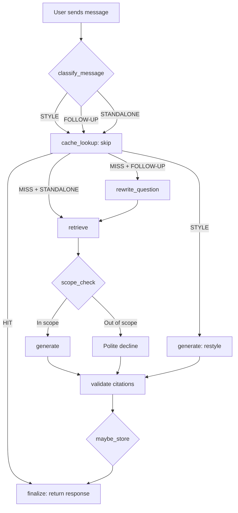

# SciQuery: NCERT Class 10 Science Chatbot with Smart Caching

**By Dhanu Gupta** | AI Intern Assignment, Prepzy.ai

---

## How the Chatbot Works

SciQuery answers student doubts from the NCERT Class 10 Science textbook. It uses a **Retrieval-Augmented Generation (RAG)** approach:

1. The textbook is split into ~800-character chunks (734 total, across 13 chapters).
2. Each chunk is embedded using a small local model (`BAAI/bge-small-en-v1.5`).
3. When a student asks a question, we find the 4 most relevant chunks using FAISS.
4. If the best chunk isn't relevant enough (cosine similarity < 0.25), we politely decline — no LLM call needed.
5. Otherwise, we send the chunks to an LLM (Groq free tier) which answers using **only** the provided context.
6. The answer cites the chapter(s) it used.

The chatbot handles three types of messages:
- **STANDALONE**: A new question. Full pipeline: cache → retrieve → answer.
- **FOLLOW-UP**: Depends on earlier turns (detected by pronouns, short length, or phrases like "what about"). The LLM rewrites it into a standalone question first.
- **STYLE**: Asks to change how the answer is presented ("simpler", "in points"). The LLM rewrites the previous answer. Never cached.

---

## How the Cache Works

The cache is the most important part of this project. A cached answer is instant and free. But a wrong cached answer teaches a student something incorrect. So the cache is **conservative by design**: it prefers a miss over a false hit.

### Lookup Flow (for STANDALONE questions)

```
Question → Normalize → Exact Hash Match?
                           ↓ no
                     Semantic Search (FAISS, cosine ≥ 0.88)
                           ↓ candidate found
                     ┌─── Number Guard ───┐
                     │  Contrast Guard     │  ALL must pass
                     │  Key-Term Guard     │  for a HIT
                     │  Question-Type Guard│
                     └────────────────────┘
                           ↓ all pass
                        CACHE HIT
```

### The Four Safety Guards

1. **Number Guard**: Extracts all numbers + units from both questions. They must be identical. "R = 20 cm" vs "R = 30 cm" → MISS.

2. **Contrast Guard**: Maintains a list of confusable term pairs (concave/convex, acid/base, series/parallel, etc.). If the questions mention different members of the same group → MISS. This catches the case where embedding similarity is high (0.95!) but the questions are about opposite concepts.

3. **Key-Term Guard**: After removing stopwords and applying synonyms, the remaining content words must overlap with Jaccard ≥ 0.65. "What is refraction?" and "What does refraction mean?" → Jaccard 1.0 → pass. "What is an alkane?" and "What is an alkene?" → different terms → fail.

4. **Question-Type Guard**: Both questions must have the same type (define, explain, numerical, list, etc.), detected by keyword rules. "Define refraction" and "List the types of refraction" → different types → MISS.

### Special Rules

- **Questions with numbers**: Only exact-match lookup is allowed. Semantic matching is skipped entirely because embeddings don't distinguish numbers well.
- **Follow-ups**: Only a contextual exact match works — the hash includes both the previous standalone question and the current follow-up. "What about its laws?" after "What is refraction?" produces a different key than after "What is reflection?".

---

## What We Cache and What We NEVER Cache

### ✅ We cache:
- Self-contained questions answered from the textbook, with at least one chapter citation.
- Follow-ups that were rewritten into standalone questions (stored under the standalone form).

### ❌ We NEVER cache:
- Style requests ("explain it more simply", "shorter")
- Out-of-scope declines
- Answers with no citation
- Error responses or failed LLM calls
- Greetings and small talk

---

## What Didn't Work

### Embeddings alone are dangerously misleading

"Image formed by a concave mirror" vs "Image formed by a convex mirror" has **cosine similarity 0.9505** — higher than many valid paraphrases! A pure threshold approach would confidently serve a wrong answer. The contrast guard catches this.

Similarly, "R = 20 cm" vs "R = 30 cm" scores **0.9244**. Embeddings encode meaning, not numbers. The number guard catches this.

### Jaccard threshold was too strict at 0.80

Short questions are very sensitive to one extra word. "Laws of reflection" vs "Laws of reflection of light" — adding "light" drops Jaccard from 1.0 to 0.67. Had to tune down to 0.65.

### Question-type ordering mattered

"What is Ohm's law?" initially matched the `define` type ("what is"), while "State Ohm's law" matched `law` ("state ... law"). Fixed by putting specific types (law, numerical) before the broad `define` catch-all.

---

## Flowchart



---

## Architecture

```
Streamlit UI  ──HTTP──▶  FastAPI  ──▶  LangGraph pipeline
                                          │
                       ┌──────────────────┼──────────────────┐
                       ▼                  ▼                  ▼
                 Cache (SQLite +     Textbook retriever   LLM (Groq,
                 FAISS cache index)  (FAISS book index)   OpenAI-compat)
```

Two separate FAISS indexes:
1. **Book index**: 734 textbook chunks for answering questions.
2. **Cache index**: Past questions for reuse (grows over time).

---

## Performance

| Metric | Value |
|--------|-------|
| Cache hit latency | ~0.2 ms |
| Embedding model | BAAI/bge-small-en-v1.5 (local, 384d) |
| Book index | 734 vectors, ~1.1 MB |
| False hits | 0 (must be 0) |
| Missed hits | 1 out of 7 test pairs |

---

*Built by Dhanu Gupta for the Prepzy.ai AI Intern assignment.*
